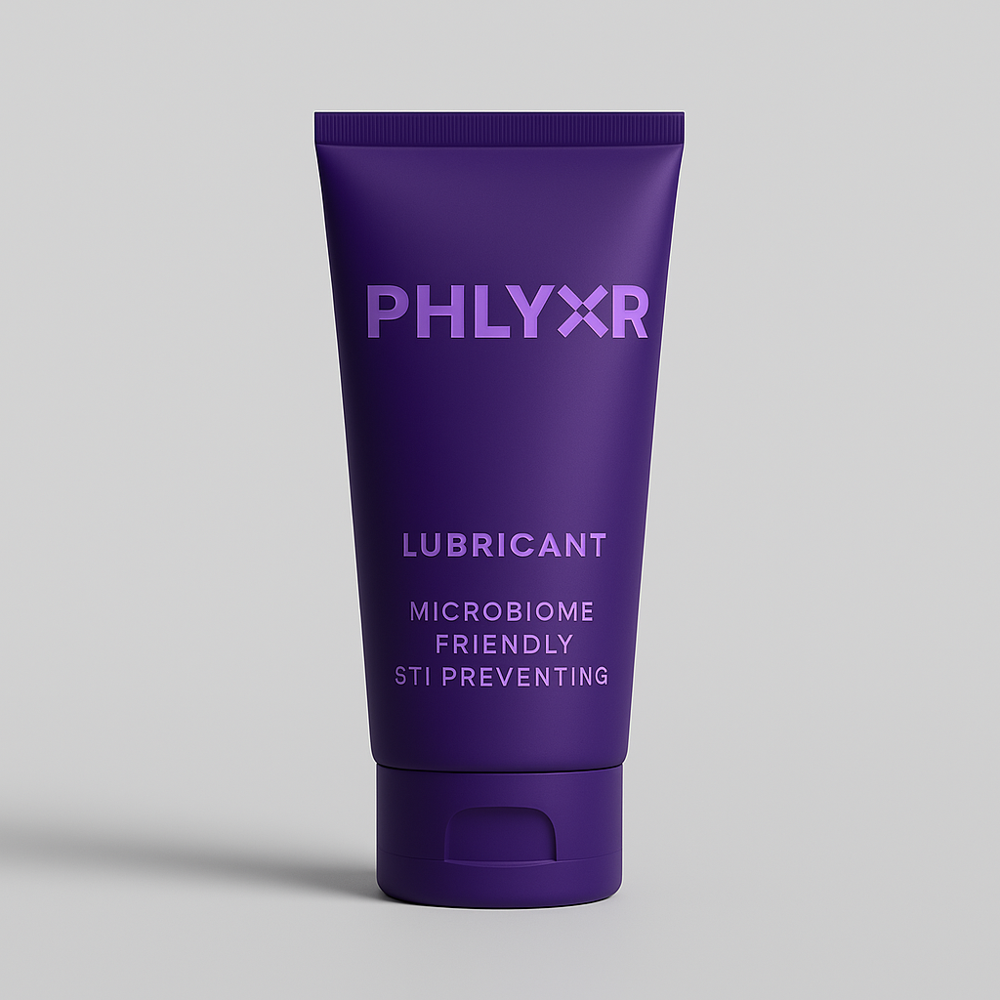

<strong>Redefining protection so you can live in the moment</strong>

A sexual lubricant that <strong>prevents STI transmission</strong>

Microbiome-friendly • STI Preventing • Contraceptive • Non-hormonal • Vegan

<a href="#waitlist" class="cta-button">Join the Waitlist</a>
<a href="#learn-more" class="cta-button.secondary">Learn More</a>

<a href="https://www.instagram.com/phlyxr/" target="_blank" aria-label="Instagram">
<svg xmlns="http://www.w3.org/2000/svg" width="28" height="28" viewBox="0 0 24 24" fill="currentColor"><path d="M12 2.163c3.204 0 3.584.012 4.85.07 3.252.148 4.771 1.691 4.919 4.919.058 1.265.069 1.645.069 4.849 0 3.205-.012 3.584-.069 4.849-.149 3.225-1.664 4.771-4.919 4.919-1.266.058-1.644.07-4.85.07-3.204 0-3.584-.012-4.849-.07-3.26-.149-4.771-1.699-4.919-4.92-.058-1.265-.07-1.644-.07-4.849 0-3.204.013-3.583.07-4.849.149-3.227 1.664-4.771 4.919-4.919 1.266-.057 1.645-.069 4.849-.069zm0-2.163c-3.259 0-3.667.014-4.947.072-4.358.2-6.78 2.618-6.98 6.98-.059 1.281-.073 1.689-.073 4.948 0 3.259.014 3.668.072 4.948.2 4.358 2.618 6.78 6.98 6.98 1.281.058 1.689.072 4.948.072 3.259 0 3.668-.014 4.948-.072 4.354-.2 6.782-2.618 6.979-6.98.059-1.28.073-1.689.073-4.948 0-3.259-.014-3.667-.072-4.947-.196-4.354-2.617-6.78-6.979-6.98-1.281-.059-1.69-.073-4.949-.073zm0 5.838c-3.403 0-6.162 2.759-6.162 6.162s2.759 6.163 6.162 6.163 6.162-2.759 6.162-6.163c0-3.403-2.759-6.162-6.162-6.162zm0 10.162c-2.209 0-4-1.79-4-4 0-2.209 1.791-4 4-4s4 1.791 4 4c0 2.21-1.791 4-4 4zm6.406-11.845c-.796 0-1.441.645-1.441 1.44s.645 1.44 1.441 1.44c.795 0 1.439-.645 1.439-1.44s-.644-1.44-1.439-1.44z"/></svg>
</a>
<a href="https://www.linkedin.com/company/phlyxr/" target="_blank" aria-label="LinkedIn">
<svg xmlns="http://www.w3.org/2000/svg" width="28" height="28" viewBox="0 0 24 24" fill="currentColor"><path d="M19 0h-14c-2.761 0-5 2.239-5 5v14c0 2.761 2.239 5 5 5h14c2.762 0 5-2.239 5-5v-14c0-2.761-2.238-5-5-5zm-11 19h-3v-11h3v11zm-1.5-12.268c-.966 0-1.75-.79-1.75-1.764s.784-1.764 1.75-1.764 1.75.79 1.75 1.764-.783 1.764-1.75 1.764zm13.5 12.268h-3v-5.604c0-3.368-4-3.113-4 0v5.604h-3v-11h3v1.765c1.396-2.586 7-2.777 7 2.476v6.759z"/></svg>
</a>

---

## 🚨 The STI Crisis {#learn-more}

STI cases are **rising dramatically across the globe**, and traditional prevention methods aren't enough.

### **+506%**
Gonorrhoea cases in Europe since 2010

### **+218%**
Gonorrhoea increase in the UK

### **+216%**
Syphilis cases rising

### **68%**
Drop in HPV vaccinations

!!! danger "The Cost of Inaction"
    **NHS Today vs. 2050**
    
    - **£180M → £3B** - Annual STI treatment costs (17x increase)
    - **1.3M → 10M** - Deaths per year from antibiotic resistance
    - **£7-13M → £11-25M/yr** - IVF costs due to STI-related infertility
    
    **Antibiotic resistance is making common STIs untreatable.**

**We need a new approach to STI prevention.**

[Explore the Problem](the-problem.md){.cta-button }

---

## 💡 Introducing PHLYXR

### **A Revolutionary Approach to Sexual Health**

PHLYXR is the world's first sexual lubricant specifically formulated to **prevent STI transmission** while providing premium lubrication.

#### ✨ **Key Features**

- **🦠 Binds viruses and bacteria** - Patentable formulation neutralizes STI pathogens
- **🧬 pH matched to vaginal microbiome** - Maintains healthy flora (pH 3.5-4.5)
- **🚫 Contraceptive** - Spermicidal properties prevent pregnancy
- **🌱 Non-hormonal, vegan** - Body-safe, sustainable ingredients
- **💊 No prescription needed** - Accessible protection for everyone

[How It Works](our-solution.md){.cta-button }

---

## 🔬 Science-Backed Innovation

PHLYXR combines cutting-edge research with practical application:

🧪

### **Patentable Formulation**
Proprietary technology coats and binds bacteria and viruses, preventing transmission at the source.

⚖️

### **Microbiome Protection**
Vaginal-matched pH (3.5-4.5) prevents disruption to healthy lactobacillus-dominant flora.

🛡️

### **Dual Protection**
Spermicidal due to acidity and further prevents sperm motility for contraceptive effects.

### **Current Development Stage**

We're currently in **preclinical in vitro testing** with formula refinement ongoing.

!!! info "Timeline Snapshot"
    - ✅ **Q1 2025** - MVP Creation (Complete)
    - ✅ **Q2/Q3 2025** - Rheological testing & characterisation (Complete)
    - 🔄 **Q4 2025-Q1 2026** - Preclinical in vitro testing & formula refinement (In Progress)
    - 📅 **Q2 2026** - Patent filing & production scaling
    - 📅 **Q3-Q4 2026** - Clinical trials at identified CRO & MHRA approval
    - 🎯 **Q4 2027** - Product launch

[View Full Timeline](timeline.md){.cta-button.secondary }

---

## 👥 Who We're For

### **Primary Audience: Women Aged 15-40**

Our research shows this demographic:

- 📊 Accounts for **>50%** of Chlamydia and Gonorrhoea cases (ages 15-24 in England, 2020)
- 💧 Purchases **more lubricant than condoms** (peak usage ages 25-34)
- 🌿 Seeks **non-hormonal, non-irritating** sexual health products
- 🔬 Values **science-backed** solutions
- 🏥 Most likely to attend sexual health services (ages 25-34)

---

## 🎓 World-Class Team

PHLYXR is developed by experts from **Imperial College London, University of Edinburgh, University of Leeds, University of Manchester, and University of Reading**.

**Sophie Stephens, MSc, MIBMS** - Biomedical Scientist/PhD Student, Microbiology specialist in women's health

**James Warren, PhD** - Biomaterial Engineering Scientist, Biofluid expert with previous patents

**Rebekah Lloyd** - Women's Health Business Consultant (Rela)

**Dr. Charlotte-Eve Short, MRCP** - Imperial STI Microbiota Group Leader

[Meet the Full Team](team.md){.cta-button }

---

## 📬 Join the Movement {#waitlist}

Be part of the sexual health revolution. PHLYXR is coming in **Q4 2027**.

### **Why Join Our Waitlist?**

✅ **Exclusive early access** to PHLYXR before public launch  
✅ **Special launch pricing** for early supporters  
✅ **Updates on clinical trials** and development milestones  
✅ **Educational content** about STI prevention and sexual health  
✅ **Input opportunities** through surveys and beta testing

<a href="https://forms.gle/your-waitlist-form" class="cta-button large" target="_blank">Join the Waitlist</a>

---

## 📋 Help Shape PHLYXR

Your feedback is invaluable. Take our 5-minute survey to help us understand:

- What features matter most to you
- Your current sexual health practices  
- Pricing preferences
- Product packaging preferences

<a href="https://forms.gle/your-survey-link" class="cta-button.secondary" target="_blank">Take the Survey</a>

---

## 🤝 Strategic Partnerships

We're building connections with leading organizations:

- **Crowdcube** - Crowdfunding platform
- **The Lowdown** - Women's health review platform
- **Unfabled** - Menstrual and hormone wellbeing marketplace
- **Boots** - Pharmacy retail partner
- **Reckitt** - Licensing opportunities

---

## 💼 Investment Opportunity

**Currently raising £1.8M** to fund critical development milestones:

| **Investment Use** | **Amount** | **Purpose** |
|-------------------|-----------|-------------|
| In vitro efficacy testing | £8k | Generate CRO safety data |
| CRO-generated safety data | £65k | Conduct preclinical in vitro efficacy testing |
| Early feasibility clinical trial | £1.18M | First phase clinical trials |
| MHRA approval | £480k | Regulatory approval process |

**Further rounds of funding** will support scale-up of manufacturing, pivotal clinical investigations, patent maintenance, and salary costings.

Interested in investing? **[Contact us](mailto:invest@phlyxr.com)**

---

## Ready to Redefine Protection?

**PHLYXR** - *Live in the moment*

<a href="#waitlist" class="cta-button">Join the Waitlist</a>
<a href="our-solution.md" class="cta-button.secondary">Learn More</a>

